# Lab3 - CI/CD with Sagemaker

In the third lab you are going to create a full CI/CD pipeline for your machine learning model so you can develop, test and deploy machine learning models in an efficient, safe and repeatable manner.

The AWS infrastructure you will be deploying will be modelled using the principle of Infrastructure as Code. Codifying your infrastructure allows you to treat your infrastructure as just code. You can author it with any code editor, check it into a version control system, and review the files with team members before deploying into production.

The lab consist of the following steps:

1. [Create a GitHub repo and create an OAuth token](#head1)
2. [Create a CI/CD pipeline using AWS CodePipeline](#head2)
3. [Bonus Exercise: Add Sagemaker Hyperparameter tuning to your Sagemaker training](#head3)

***

### <a name="head1">Create a GitHub repo and create an OAuth token</a>

1. To integrate your continous delivery pipeline with GitHub, you will use OAuth tokens. Go to [GitHub's Token Settings](https://github.com/settings/tokens) to generate your token and ensure you enable the following two scopes:

- **repo**, which is used to read and pull artifacts from public and private repositories into a pipeline

- **admin:repo_hook**, which is used to detect when you have committed and pushed changes to the repository

  **Make sure to copy your new personal access token now as you will need it later.**

  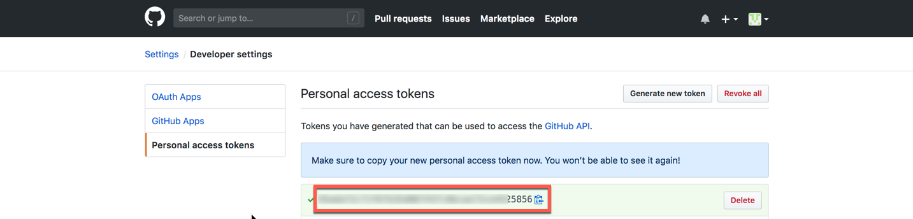

2. You will need a GitHub repo for your code. In GitHub create a new repository called "ml-id-lab3" and make sure it is public. Do not initialize with a README file and do not add any .ignore or license file. Copy your GitHub repo URL as you will need it later.

   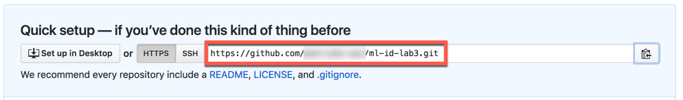

3. Open up a terminal (or cmd on Windows) and change directory into the directory where you extracted the Immersion Day material earlier. Now initialize your git repository by running the following command lines:

   ```bash
   cd Lab3
   git init
   ```

   The output will look something like this:

   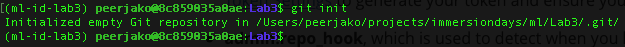

4. Stage your files running the following command lines:

   ```bash
   git add .
   git commit -am "First commit"
   ```

5. Set the remote origin and push the files by running the following command lines (use the GitHub repo URL from step 2):

   ```bash
   git remote add origin https://github.com/<GITHUBUSER>/ml-id-lab3.git
   git push -u origin master
   ```

   Now validate that you have a CloudFormation directory and Source directory in your GitHub repo.

   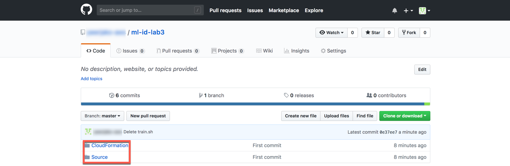


###<a name="head2">Create a CI/CD pipeline using AWS CodePipeline</a>

Now that you have a GitHub repo with your AWS infrastructure code and your machine learning python code, you are ready to create a CI/CD pipeline.

1. In case you have been logged out, sign into the AWS Management Console <https://console.aws.amazon.com/>, and confirm that you are working in the correct region.

2. We will create our CI/CD pipeline using a CloudFormation template. Use [this link](https://console.aws.amazon.com/cloudformation/home#/stacks?filter=active) to go to the AWS CloudFormation dashboard.

3. Click on the **Create Stack** button.

   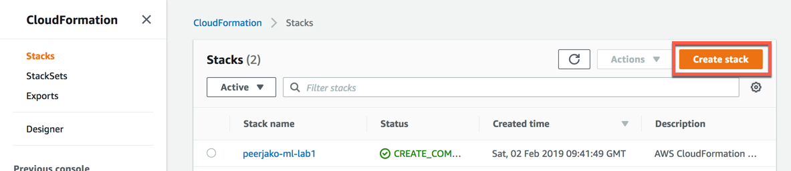

4. You will create the stack using an existing CloudFormation template from your local disk located in the Lab3/CloudFormation directory of the Immersion Day material. Click on the **Upload a template file** button and then on the **Choose file** button.

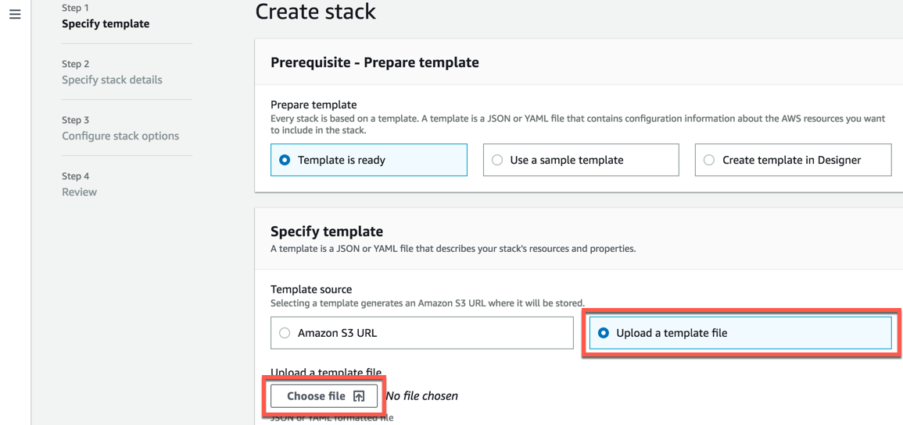 

5. Navigate to the Lab3/CloudFormation directory and double click the **codepipeline.yaml** file.

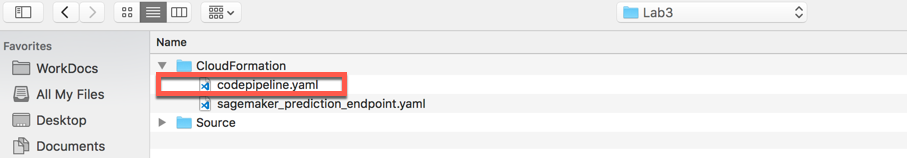

6. Now click the **Next** button.

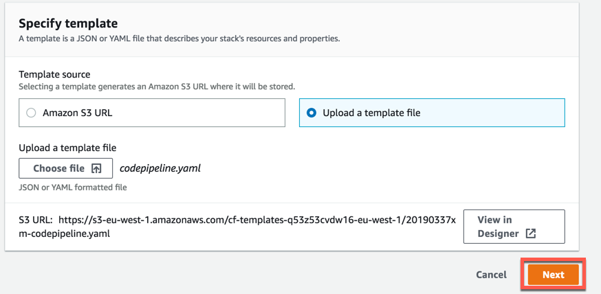

7. You will now configure your stack. Type **[Your-Initials]-ml-lab3** into the **Stack name** text box (do not use a name longer than 15 characters. If curious why, ask your lab instructor.)


   For the stack settings parameters configure them like this

   **Email** 

   ```
   Enter your email address here. This is so you can receive CI/CD notifications.
   ```

   **GitHubToken**

   ```
   This is the GitHub OAuth token you created in the beginning of this lab. It might
   look something like this: 9b189a1654643522561f7b3ebd44a1531a4287af
   ```

   **GitHubUser**

   ```
   This is the user name of the GitHub account where you just created the repo.
   ```

   **Repo**

   ```
   This is the name of the GitHub repo you just created. It is probably: ml-id-lab3
   ```

   **Branch**

   ```
   Leave the git branch as: master
   ```

   **YourInitials**

   ```
   This is the initials you used in lab 1. This will make sure lab 3 reuses the bucket and the Glue Data Catalog Database that was created in lab 1.
   ```

8. Now that you have typed in all the parameters click the **Next** button.


9. On this next page you leave all settings as default so scroll down to the bottom of the page and click the **Next** button.

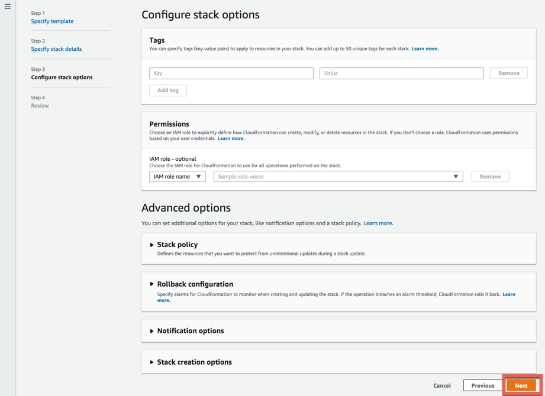

10. On this next page scroll down to the bottom of the page and click the **I acknowledge that AWS CloudFormation might create IAM resources with custom names** check box. This give CloudFormation the right to create the IAM roles needed by the CodePipeline, CodeBuild and Sagemaker services. Now click the **Create stack** button.

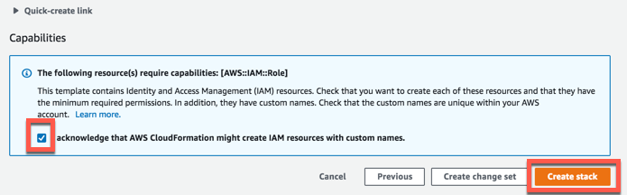

11. Now the CloudFormation Stack is being created. Click on the **Stack info** tab and then wait for the **Stack status** to change from **CREATE_IN_PROGRESS** to **CREATE_COMPLETE**.

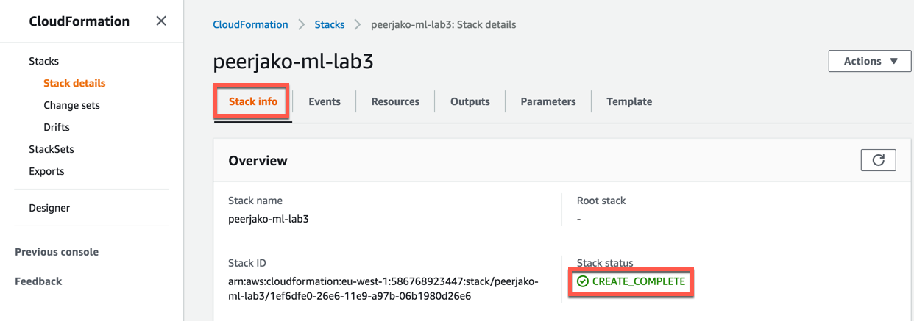


12. The stack will create an SNS topic to send notifications to the email address entered as a parameter. Upon creation of the topic, a confirmation email will be sent, open the email and confirm the topic subscription by following the **Confirm subscription** link to receive further notificiations.

13. The CloudFormation stack will create a CodePipeline that executes your Sagemaker CI/CD pipeline. Go to the CodePipeline console:  [https://console.aws.amazon.com/codepipeline/home#/dashboard](https://console.aws.amazon.com/codepipeline/home#/dashboard)

   Click on the name of the pipeline called something like this: **[Your-Initials]-ml-id-lab3**

   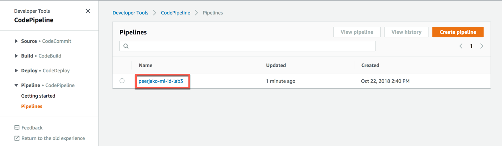

14. You should see a pipeline that consists of 4 different stages:

15. **Source** - this stage pulls the input source files from the GitHub repo you created earlier. The source files are zipped and uploaded to an S3 bucket. This source zip-file will then serve as input to the following pipeline stages. Every time you push new commits into your GitHub repo, the pipeline will execute again automatically pulling your latests commits. You can see the the S3 pipeline artifact bucket in the S3 management console: [https://s3.console.aws.amazon.com/s3/home](https://s3.console.aws.amazon.com/s3/home)

     The bucket is called something like **[Your-Initials]-ml-lab3-pipeline-artifact-store**

16. **Build\_and\_Train** - This stage runs a CodeBuild build using a python 3.4.5 build container. It runs the **prepdata.py** and **train.py** python scripts that you can find in the **Source** directory of your GitHub repo. 

- prepdata.py - This python script is very similar to the first part of the python notebook you ran manually in lab 2. It ends up creating a training data file and test data file that can be used by the Sagemaker training. It uses Athena to dynamically get some of the parameters that were hardcoded in the lab 2 notebook.

- train.py - This python script is similar to the training part of the python notebook you ran manually in lab 2. It creates a training job in Sagemaker which ends up producing an ML model that you can you can use for ML inference through Sagemaker endpoints.

After the two scripts have executed, CodeBuild packages and uploads the build artifacts to an S3 bucket. In this case the artifacts include the test data file and some config files used in the next pipeline stages.

If you click the **Details** link of the **Build\_and\_Train** stage then you will go to the CodeBuild details page. In the bottom of CodeBuild details page you can see the build logs. You will find these logs very similar to the logs you saw when running the python notebook in lab 2.

  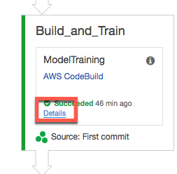

3. **QA** - this stage uses the CloudFormation template file **sagemaker\_prediction\_endpoint.yaml** found in the **CloudFormation** directory. CloudFormation is used to launch a Sagemaker QA Endpoint based on the ML model created in the Build\_and\_Train stage. 

When the Sagemaker QA Endpoint has launched (this can take up to 5 minutes) the Endpoint is tested by running a CodeBuild build that executes the **test.py** python script found in the **Source** directory. This python script is very similar to the last part of the python notebook you ran manually in lab 2. It will call the Sagemaker endpoint and compare the inference results with the results from the test data file. If less than 80% of the inferences are not producing the same result as found in the test data file, then an exception is thrown and the pipeline stage will fail.

If you click the **Details** link of the **LaunchEnpoint** step then you will go to details of the CloudFormation stack of the Sagemaker Endpoint.

If you click the **Details** link of the **TestEndpoint** step then you will go to the CodeBuild build details. 

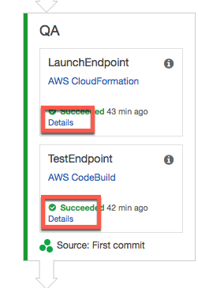

Click the **Details** link of the TestEndpoint and scroll all the way down on that page to see the build logs. In the build logs you will see the result of the tests including how many tests was correctly predicted. With a **Match Rate** of 80% you can see that the test barely passes our 80% threshold. In the Bonus part of this lab we will improve this match rate.

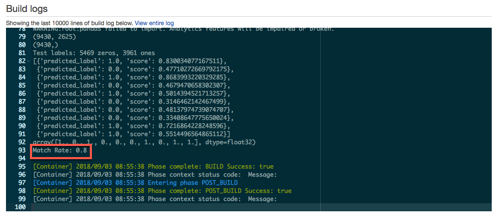


**Production** - this stage first starts with an approval gate. In order to continue the pipeline you have to manually approve. Click the **Review** button.

   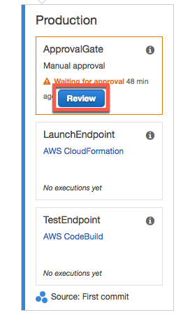

   A pop-up is opened. Type in a comment in the **Comments** text box and click the **Approve** button.

   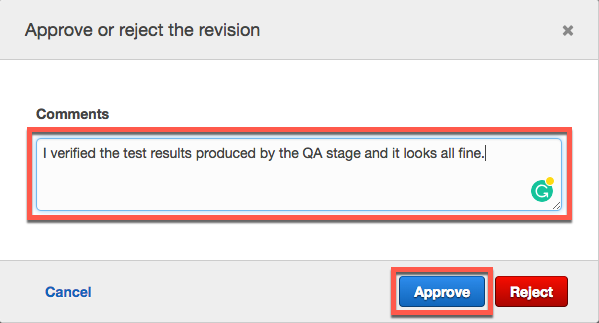


The rest of the production stage creates a Sagemaker production Endpoint and runs an Endpoint test similar to the QA stage. The creation of the production endpoint should take approximately 5 minutes.

------

**Congratulations! You have now successfully created a fully functional CI/CD pipeline for your machine learning project.** 

If you update the pythons scripts and push the changes into your GitHub repo you will automatically trigger a redeployment of your ML endpoints based on a new version of the ML model. Using a CI/CD pipeline with a QA stage and a manual approval step, you can safely develop and incrementally improve the quality of your ML inference endpoints while using best practices from a DevOps perspective.

In the Sagemaker console you can view the training job, the ML model and the QA and Production endpoints created by the CI/CD pipeline:

- Sagemaker Jobs: https://console.aws.amazon.com/sagemaker/home#/jobs

- Sagemaker Models: https://console.aws.amazon.com/sagemaker/home#/models

- Sagemaker Endpoints: https://console.aws.amazon.com/sagemaker/home#/endpoints


You might already be using a CI/CD solution in your job such as Jenkins, CircleCI or TeamCity. Most of the parts of this lab 3 are reusable and do not depend on AWS CodePipeline. You can use the ideas behind the pipeline and the different parts as an inspiration to create a CI/CD pipeline in the CI/CD solution you are already using at your job.

### <a name="head3">Bonus Exercise: Add Sagemaker Hyperparameter tuning to your Sagemaker training</a>

Automatic Model Tuning eliminates the undifferentiated heavy lifting required to search the hyperparameter space for more accurate models. With Amazon SageMaker Automatic Model Tuning you save significant time and effort in training and tuning your machine learning models.

A Hyperparameter Tuning job launches multiple training jobs, with different hyperparameter combinations, based on the results of completed training jobs. SageMaker trains a “meta” machine learning model, based on Bayesian Optimization, to infer hyperparameter combinations for our training jobs.

You will now change your existing python training code to use Hyperparameter Tuning.

1. Open the file Lab3/Source/train.py with your favorite text editor.

2. Go to line 136 and change the variabel **no\_hyper\_parameter\_tuning** to **False** and save the changes

   ```python
   no_hyper_parameter_tuning = False
   ```

3. Now you will commit and push your change to github. In your terminal run the following

   ```bash
   git commit -am "Do Hyperparameter Tuning"
   git push -u origin master
   ```

4. CodePipeline will automatically detect that a new commit has been pushed to your github repo and start a new pipeline execution.

   You can go and check this here:

   https://console.aws.amazon.com/codepipeline/home#/dashboard

   When the Build\_and\_Train stage of the pipeline has started running you can see a Hyperparameter tuning job here:

   https://console.aws.amazon.com/sagemaker/home#/hyper-tuning-jobs

   You can see how that job has created multiple training jobs here:

   https://console.aws.amazon.com/sagemaker/home#/jobs

5. When all the training jobs has finished the code will get that model from the best performing training job and the pipeline will use that model for QA and Production. In the QA test logs you can verify that the inference quality has improved from an 80% match rate to a 90% match rate.


The code for creating a Hyperparameter Tuner looks like this

```python
    my_tuner = HyperparameterTuner(
        estimator=fm,
        objective_metric_name='test:binary_classification_accuracy',
        hyperparameter_ranges={
            'epochs': IntegerParameter(1, 200),
            'mini_batch_size': IntegerParameter(10, 10000),
            'factors_wd': ContinuousParameter(1e-8, 512)},
        max_jobs=4,
        max_parallel_jobs=4)

```

Here you can see that **epochs**, **mini\_batch\_size** and **factors\_wd** are the parameters that are being tuned. In a real world scenario you would need more than just 4 jobs (**max\_jobs**) to find the optimal model. 


You can read a blog post that goes into the details of Hyperparameter Tuning here:

https://aws.amazon.com/blogs/aws/sagemaker-automatic-model-tuning/

